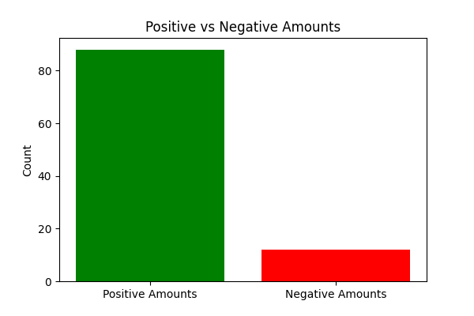
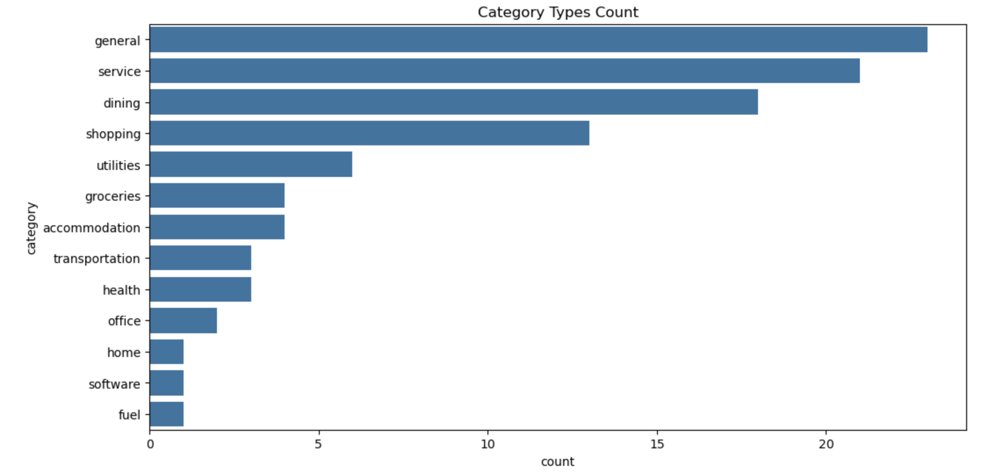

# PostgreSQL V2 Bills Maxint App

## Tasks/Goals
The entire goals of this project is located in the [tasks](./tasks/) directory.

## Step by Step Approach to the Solution

### Analysis of the Database
The database is a CSV file containing bank transaction data with columns: id, createdAt, externalId, type, amount, date, description, category, counterParty, recurring, tag, accountExternalId, and location.

| Parameter         | Description                                                    |
| ----------------- | -------------------------------------------------------------- |
| id                | The unique identifier for the transaction.                     |
| createdAt         | The timestamp when the transaction was created.                |
| externalId        | The external identifier for the transaction.                   |
| type              | The type of transaction (e.g., card_payment, digital_payment). |
| amount            | The amount of the transaction.                                 |
| date              | The date of the transaction.                                   |
| description       | The description of the transaction.                            |
| category          | The category of the transaction.                               |
| counterParty      | The counterparty involved in the transaction.                  |
| recurring         | A flag indicating whether the transaction is recurring.        |
| tag               | A tag associated with the transaction.                         |
| accountExternalId | The external identifier for the account.                       |
| location          | The location of the transaction.                               |

### EDA (Exploratory Data Analysis)
The EDA is done in the [notebooks](./notebooks/) directory.

### Parameter Analysis

#### id

The id parameter is a unique identifier for the transaction. It is a string data type. There is 100 unique values in the id column. It is the representation of the transaction.


#### createdAt

The createdAt parameter is the timestamp when the transaction was created. There is only 1 unique value in the createdAt column. Therefore, all of the transactions were created at the same time.


#### externalId

The externalId parameter is the external identifier for the transaction. It is a string data type. There is 100 unique values in the externalId column. It is the representation of the transaction.


#### type

The type parameter is the type of transaction (e.g., card_payment, digital_payment). It is a string data type. There are 16 unique values in the type column. 


The maximum number of transactions is card_payment. The minimum number of transactions is charge.

### amount

The amount parameter is the amount of the transaction. It is a float data type. There are 88 positive values and 12 negative amounts in the amount column.



### date

The date parameter is the date of the transaction. It is a string data type. There are 76 unique values in the date column.


### description

The description parameter is the description of the transaction. It is a string data type. There are 57 unique values in the description column.


### category

The category parameter is the category of the transaction. It is a string data type. There are 13 unique values in the category column.



### counterParty

The counterParty parameter is the counterparty involved in the transaction. It is a string data type. There are 57 unique values in the counterParty column.


### recurring

The recurring parameter is a flag indicating whether the transaction is recurring. It is a boolean data type. There are 0 unique values in the recurring column.

### tag

The tag parameter is a tag associated with the transaction. It is a string data type. There are 3 unique values in the tag column.


### accountExternalId

The accountExternalId parameter is the external identifier for the account. It is a string data type. There are 3 unique values in the accountExternalId column.


### location

The location parameter is the location of the transaction. It is a string data type. There are 3 unique values in the location column.


## Recurring Identification Methodology

The methodology for identifying recurring transactions is located in the [docs](./docs/) directory.

## Solution

This project processes bank transaction data to identify recurring bill payments and uploads the results to Supabase.

## Setup

1. Install the required dependencies:
   ```
   pip install -r requirements.txt
   ```

2. Set up your Supabase credentials in the `.env` file:
   ```
   SUPABASE_URL=your_supabase_project_url
   SUPABASE_KEY=your_supabase_api_key
   ```

## Usage

1. Set up the database structure in Supabase:
   - Log in to your Supabase project.
   - Navigate to the SQL Editor.
   - Copy the contents of the `scripts/create_recurring_transactions_view.sql` file.
   - Paste the SQL into the SQL Editor and execute it.
   
   This will create the necessary table and view in your Supabase project.

2. Process the raw CSV file and generate recurring transactions:
   ```
   python scripts/process_transactions.py
   ```
   This will create a new file `tasks/recurring_transactions.csv` with the identified recurring transactions.

3. Upload the processed data to Supabase:
   ```
   python scripts/upload_to_supabase.py
   ```
   This will upload the data from `tasks/recurring_transactions.csv` to your Supabase project.

## SQL Execution Sequence

There is only one SQL file that needs to be executed:

1. `scripts/create_recurring_transactions_view.sql`: This script creates the `recurring_transactions` table and the `recurring_transactions_view` view. It also grants the necessary permissions to the authenticated role.

Execute this script in your Supabase SQL Editor before running the Python scripts to process and upload data.

## Viewing Results

After setting up the table and view, and uploading data, you can query the view in your Supabase project using:

```sql
SELECT * FROM recurring_transactions_view;
```

This will display the recurring transactions with the following columns:
- amount: The amount due for the bill
- description: The description of the transaction
- next_date: The predicted date for the next occurrence
- last_date: The date of the last occurrence
- first_date: The date of the first occurrence

The view is ordered by the next_date in ascending order.

## Testing

To verify that your setup is working correctly, you can run the following tests in your Supabase SQL Editor:

1. Insert test data:

```sql
INSERT INTO recurring_transactions (amount, description, next_date, last_date, first_date)
VALUES 
(100.00, 'Test Subscription', '2023-04-01', '2023-03-01', '2023-01-01'),
(50.50, 'Test Utility Bill', '2023-04-15', '2023-03-15', '2023-02-15');
```

2. Query the view to check the inserted data:

```sql
SELECT * FROM recurring_transactions_view;
```

You should see two rows in the result, one for each inserted transaction, with the columns as described in the "Viewing Results" section.

3. To clean up after testing, you can run:

```sql
DELETE FROM recurring_transactions WHERE description LIKE 'Test%';
```

These tests will help you confirm that:
- You can insert data into the recurring_transactions table.
- The recurring_transactions_view is correctly set up and displaying data.
- The view is ordering results by next_date as expected.

If you encounter any issues during testing, double-check that you've correctly executed the SQL script to create the table and view, and that you have the necessary permissions.

## Project Structure

- `docs/`: Contains project documentation
  - `recurring_identification_methodology.md`: Describes the methodology for identifying recurring transactions
  - `implementation_details.md`: Provides details on the implementation of the recurring transaction identification
- `notebooks/`: Contains Jupyter notebooks for exploratory data analysis
- `scripts/`: Contains Python scripts for processing and uploading data
  - `process_transactions.py`: Identifies recurring transactions from raw data
  - `upload_to_supabase.py`: Uploads processed data to Supabase
  - `create_recurring_transactions_view.sql`: SQL script to create the view in Supabase
- `tasks/`: Contains the raw transaction data and project goals

## Implementation Details

- The `process_transactions.py` script uses a scoring system to identify recurring transactions based on:
  - Time interval regularity (weight: 0.3)
  - Amount consistency (weight: 0.25)
  - Transaction type match (weight: 0.1)
  - Category match (weight: 0.1)
- The `upload_to_supabase.py` script uses the Supabase Python client to upload the processed data to your Supabase project.
- The PostgreSQL view `recurring_transactions_view` provides an efficient way to query the recurring transactions data.

For more detailed information about the implementation, please refer to the `docs/implementation_details.md` file.

## Note

Make sure to handle your Supabase credentials securely and not share them publicly.
